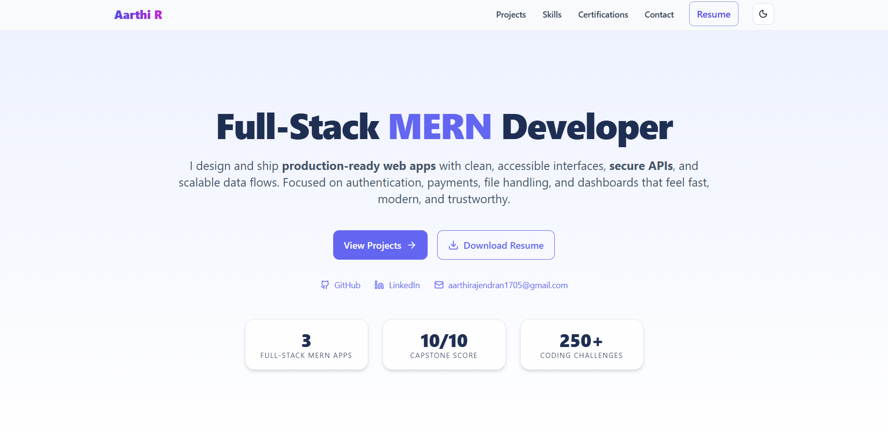

# 💼 Aarthi R – Full Stack Developer Portfolio  

A modern, fully responsive **Full Stack Developer Portfolio** built using **⚛️ React, 🎨 TailwindCSS, and 🎥 Framer Motion**, showcasing my **MERN-based projects, professional skills, and certifications** with smooth animations and a clean, production-ready design.

---

## 🚀 Features  
✨ Modern, responsive UI (mobile-first)  
🎬 Smooth scroll animations powered by **Framer Motion**  
🧭 Scrollspy navigation with active section highlights  
💡 Dynamic light/dark mode support  
📄 Integrated Resume (**View & Download**)  
📂 Structured sections:
   - 👋 **Hero** – professional intro with CTAs  
   - 🙋 **About Me** – summary of my tech journey  
   - 🛠 **Skills** – core technologies & tools  
   - 💻 **Projects** – live demos, GitHub links, and detailed case studies  
   - 🏆 **Certifications** – verified learning credentials  
   - 🤝 **Why Hire Me** – strengths & career impact  
   - 📬 **Contact** – Formspree + Gmail fallback  
   - ⚡ **Footer** – credits & social handles  

---

## 🛠 Tech Stack  
- **Frontend:** ⚛️ React, 🎨 TailwindCSS  
- **Backend:** 🧩 Node.js, 🚀 Express.js  
- **Database:** 🍃 MongoDB  
- **Animations:** 🎥 Framer Motion  
- **Icons:** 🖼 Lucide React  
- **Forms:** 📧 Formspree  
- **Deployment:** ▲ Vercel  

---

## 📂 Project Structure  

src/
├─ components/ # 🔧 Reusable UI components (Navbar, Hero, Footer, etc.)
├─ data/ # 📊 Profile data (skills, projects, resume links)
├─ pages/ # 📄 Pages (Home, CaseStudy, Project Details)
└─ index.css # 🎨 Global styles & Tailwind utilities

---

## 💻 Highlight Projects  

- 🏨 **Hotel Booking System (CasaStay)** – Full-stack MERN booking app with search, filters, payments, and verified reviews.  
- 🧾 **Invoice Builder** – React + Context API tool for invoices, clients, and PDFs.  
- 💰 **Smart Expense Tracker** – Real-time expense insights, CRUD with charts, and local persistence.  

---

## 📸 Preview  

---

## 🔗 Live Demo  
👉 [View Portfolio](https://your-portfolio-link.vercel.app)

---

## 📄 Resume  
📥 [Download Resume](public/resume/Aarthi-R-Resume.pdf)

---

## 👩‍💻 Author – Aarthi R  
- 🔗 [LinkedIn](https://linkedin.com/in/aarthi-r-66944628a)  
- 💻 [GitHub](https://github.com/Aarthi1720)  
- ✉️ [aarthirajendran1705@gmail.com](mailto:aarthirajendran1705@gmail.com)

---

> 💬 *“I turn ideas into clean, scalable web solutions — powered by React, Node, and MongoDB.”*
